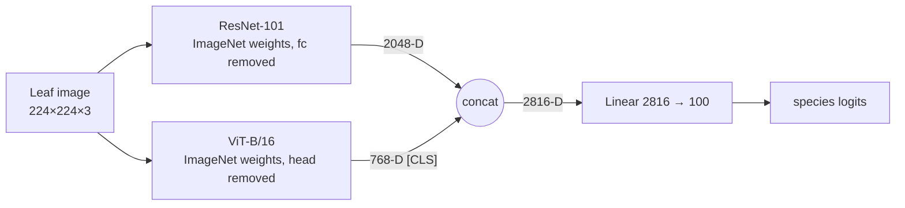
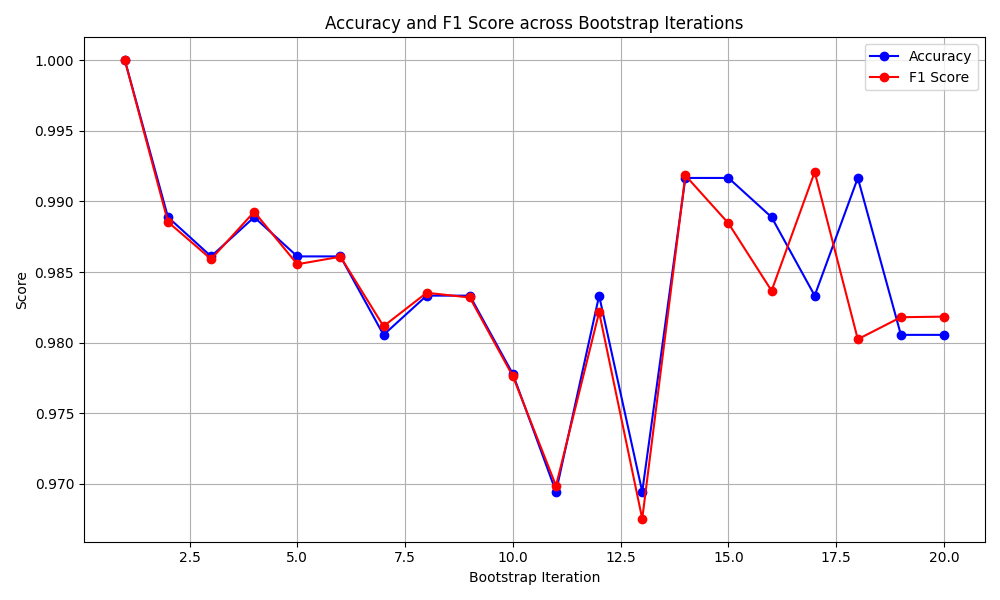
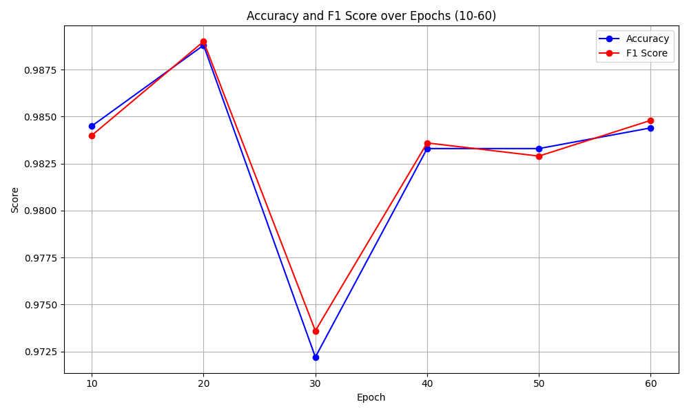
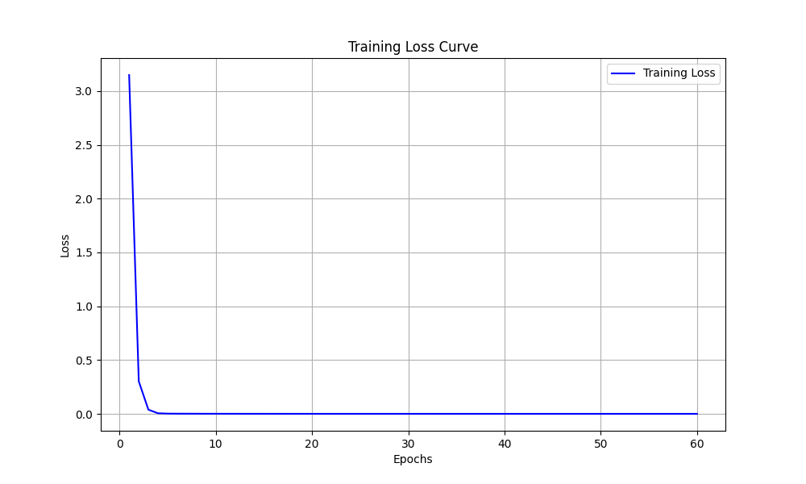

# Plant Leaf Recognition with a Hybrid ResNet–ViT

[](https://github.com/asher0913/plant-leaf-recognition/actions/workflows/ci.yml)


[](LICENSE)

100-species leaf classification by fusing a **ResNet-101** (local texture, venation, margins) with a
**ViT-B/16** (global shape and layout). The two pooled embeddings are concatenated into a 2,816-D
vector and classified by one linear layer; both backbones are fine-tuned end to end.

| Model | Top-1 accuracy | Weighted F1 |
|---|---:|---:|
| **ResNet-101 + ViT-B/16 hybrid** | **98.46% ± 0.71** | **98.40% ± 0.73** |
| ViT-B/16 alone | 97.69% | 97.60% |
| Best handcrafted pipeline (MTD + LBP-HF + SVM) | 96.88% | 96.82% |
| ResNet-101 alone | 94.70% | 94.42% |

Mean (± standard deviation) over **20 random 70/30 train/test partitions** of the CVIP100 leaf
dataset, training a fresh model on each. The full comparison is in
[`results/reported_results.json`](results/reported_results.json).

## Architecture



| Component | Parameters |
|---|---:|
| ResNet-101 trunk | 42.50 M |
| ViT-B/16 encoder | 85.80 M |
| Fusion head | 0.28 M |
| **Total (all trainable)** | **128.58 M** |

The single-branch ablations (`--arch resnet101`, `--arch vit`) reuse the same head, loss, optimiser and
split protocol, so the comparison isolates the effect of fusing the two representations.

## What the results say

- **Fusion helps, and the two branches are complementary.** The hybrid beats its better branch (ViT)
  by 0.8 points and its weaker branch (ResNet-101) by 3.8 points under an identical protocol.
- **A CNN alone is not enough here.** With roughly a dozen images per species, a fine-tuned
  ResNet-101 scored *below* every handcrafted shape-and-texture pipeline, while the ViT scored above
  all of them. That is consistent with species identity depending heavily on global outline,
  which self-attention relates across the whole image and a local convolutional stack sees only late.
- **Ten epochs are enough.** In a 60-epoch study the training loss fell from 3.15 to 0.30 within two
  epochs and was essentially zero after six; mean test accuracy at epoch 60 (98.44%) was no better
  than at epoch 10. The final protocol stops at 10 epochs, a 6× saving in compute.

<p align="center">
  
  
</p>
<p align="center">
  
</p>

*Left: accuracy and weighted F1 on each of the 20 partitions (labelled "bootstrap iteration" in the
original plot; each point is an independent random 70/30 split). Right: mean over splits when the
same runs are evaluated every 10 epochs. Bottom: mean training loss over 60 epochs.*

## Quick start

```bash
python -m venv .venv && source .venv/bin/activate
pip install torch torchvision          # choose the CUDA build for your GPU
pip install -e '.[dev]'
```

Arrange the dataset as one folder per species (any image format Pillow reads):

```text
data/leaves/
├── acer_palmatum/
│   ├── 0001.jpg
│   └── …
└── quercus_robur/
    └── …
```

Reproduce the hybrid result and its ablations:

```bash
leafnet run --data-dir data/leaves --arch hybrid    --output-dir runs/hybrid    --amp
leafnet run --data-dir data/leaves --arch vit       --output-dir runs/vit       --amp
leafnet run --data-dir data/leaves --arch resnet101 --output-dir runs/resnet101 --amp

# the 60-epoch study, evaluating every 10 epochs in the same run
leafnet run --data-dir data/leaves --epochs 60 --eval-epochs 10 20 30 40 50 60 --output-dir runs/epochs

leafnet summarize runs/hybrid/results.json
```

```text
hybrid over 20 splits
  top1         98.46 ± 0.71  (range …)
  f1_weighted  98.40 ± 0.73  (range …)
```

Each run writes `results.json` after every split: per-split metrics, the loss curve, any intermediate
evaluations, timing, the exact configuration and the software environment. If a job is interrupted,
rerunning the same command resumes from the next unfinished split; changing the protocol (split
seed, test size, stratification, architecture or input size) against an existing results file is
refused rather than silently mixed.

Save checkpoints with `--save-models`, then classify new images:

```bash
leafnet predict --checkpoint runs/hybrid/model_split00.pt --input photos/ --top-k 3
```

## Design decisions

- **Stable label mapping.** Class folders and files are sorted before labels are assigned. The
  original script used `os.listdir` order, which is filesystem dependent, so a checkpoint could map
  to the wrong species on another machine.
- **Stratified splits by default.** With about 12 images per class, an unstratified 30% split can
  leave a species with one or zero test images. Stratification keeps every species at the same
  train/test ratio. `--no-stratify` restores the original split procedure.
- **Independently reproducible splits.** Split *i* uses `random_state = seed + i`, and the model,
  data order and augmentation are seeded from the same value, so any single split can be rerun on
  its own to investigate an outlier.
- **One training loop for every model.** Architectures differ only in which branches feed the
  shared `HybridClassifier`, which rejects a branch whose output width does not match its declared
  dimension rather than failing later inside the linear layer.
- **Honest naming.** The write-up called the protocol "bootstrap sampling", but splits are drawn
  without replacement. It is repeated random sub-sampling (Monte Carlo cross-validation) and the
  code is named accordingly.

## Evaluation caveats

- The 20 test sets overlap heavily and share most of their training data, so the ± values describe
  split-to-split variability, not a confidence interval on accuracy for new leaves.
- There is no separate validation set. The 10-epoch budget was chosen from a 60-epoch study on the
  same splits, which introduces mild selection bias (the choice was driven by cost rather than a
  measurable accuracy gain).
- CVIP100 is a curated single-leaf benchmark. Accuracy on field photographs with clutter,
  occlusion and lighting variation would likely be lower; that is the natural next benchmark.
- The handcrafted baselines in the comparison table were run with a separate reference
  implementation and are listed for context; they are not part of this package.

## Repository layout

```text
src/leafnet/
├── data.py        folder indexing, transforms, stratified repeated splits
├── model.py       HybridClassifier, ResNet-101 / ViT-B/16 branches, ablations
├── engine.py      training loop (Adam/AdamW, AMP, clipping), inference
├── metrics.py     top-1, weighted/macro F1, per-class accuracy, split summaries
├── experiment.py  resumable 20-split campaign → results.json
├── predict.py     top-k inference from a checkpoint
└── cli.py         `leafnet run | summarize | predict`
tests/             26 tests: data, model shapes, metrics, end-to-end campaign, resume
results/           reported numbers and protocol
docs/figures/      plots from the reported campaign
```

## Tests

```bash
pytest -q
```

The suite needs no GPU and downloads nothing. It builds a synthetic three-species image folder,
runs a two-split campaign end to end with lightweight stand-in backbones, checks resume and protocol
mismatch handling, and instantiates the real ResNet-101 + ViT-B/16 hybrid (without weights) to pin
its 2,816-D fusion width and 128.6 M parameter count.

## License

MIT
